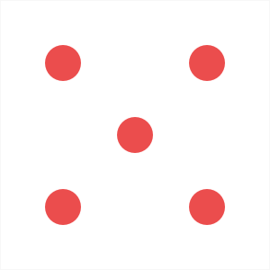

     

# Considerações iniciais
Como pig-game é um jogo simples, com um código relativamente pequeno, e que **_tem como propósito somente a manipulação do DOM_** (além da diversão), eu optei por não separar os arquivos Javascript, sendo assim nenhum tipo de refatoramento de arquivos foi utilizado.

# Pig-game
Pig-game é um jogo desenvolvido com o objetivo de demonstrar manipulações que podem ser realizadas no DOM.

## Inicializar a aplicação
Para inicializar a aplicação o usuário deverá **_baixar a extensão Live-Server_** para a sua IDE e iniciar o arquivo index.html com o Live-Server.

## Regras do jogo
1. O jogo possui 2 jogadores, jogando em rounds;
2. A cada turno, um jogador gira os dados quantas vezes ele desejar. Cada resultado será adicionado ao seu Round Score;
3. MAS, se o jogador girar o numero 1 em algum dos dados, todo seu Round Score será perdido e será a vez do próximo jogador;
4. SE o jogador girar os dados e ambos cairem em 6, toda a sua pontuação será perdida, incluindo o Round Score e o Global Score. Depois disso será o proximo jogador;
5. O jogador pode escolher "segurar" seus pontos clicando em "Hold", o que significa que o seu Round Score será adicionado ao seu Global Score. Depois disso será o próximo jogador;
6. O primeiro jogador que alcançar 100 pontos em seu Global Score ganha o jogo;

-------------------

1. The game has 2 players, playing in rounds
2. In each turn, a player rolls a dice as many times as he whishes. Each result gets added to his ROUND score
3. BUT, if the player rolls a 1, all his ROUND score gets lost. After that, it's the next player's turn
4. IF the player rolls two 6, he loses everything (score);
5. The player can choose to 'Hold', which means that his ROUND score gets added to his GLBAL score. After that, it's the next player's turn
6. The first player to reach 100 points on GLOBAL score wins the game

## Configurações adicionais
1. Os jogadores podem escolher a pontuação máxima da partida preenchendo o campo "Set the max score", entretanto, se nenhuma pontuação for escolhida o jogo terá uma pontuação máxima de 100 pontos;
2. Ao clicar no botão "New Game" um novo jogo será iniciado.
